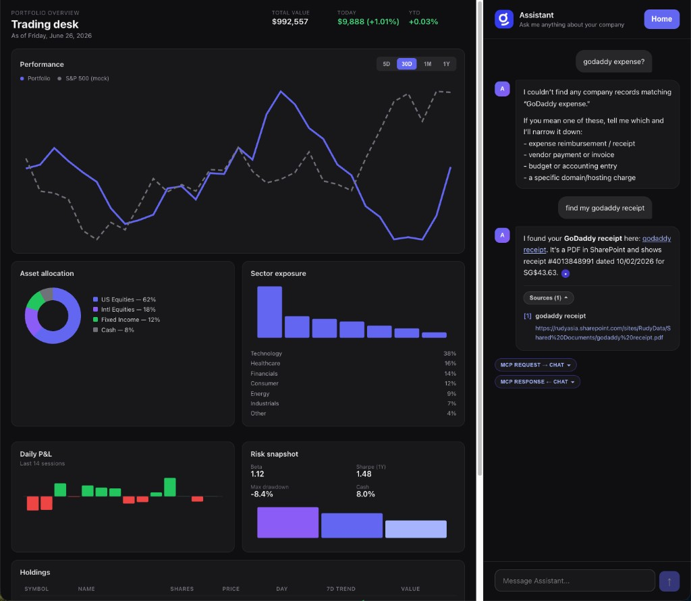

# MCP Chatbot

A chat UI that looks like a normal assistant but always answers by calling Glean MCP on the backend. No Glean SDK in the browser, no LLM — every question goes straight to Glean's `chat` tool.



## Running it

```bash
cd backend && python -m venv .venv && source .venv/bin/activate
pip install -r requirements.txt
cp .env.example .env   # only SESSION_SECRET required
python main.py
```

```bash
cd frontend && npm install && npm run dev
```

Open http://localhost:5174 → paste your **Glean MCP URL** on the home page → **Continue to chat** → **Sign in** → ask something.

Your MCP URL comes from Glean Admin → Platform → Glean MCP server (e.g. `https://your-tenant-be.glean.com/mcp/default`). No need to put it in `.env`.

```
┌─────────────┐     SSE      ┌──────────────┐    MCP/HTTP    ┌─────────────────┐
│  React UI   │ ◄──────────► │ FastAPI      │ ◄────────────► │ Glean MCP       │
│  (Vite)     │   + cookies  │ + OAuth DCR  │  Bearer token  │ (chat tool)     │
└─────────────┘              └──────────────┘                └─────────────────┘
```

## What we're building

I wanted the simplest possible demo of "chatbot UI → MCP tool call" without wiring up a model or embedding Glean in the frontend.

| Piece            | What it does                                                    |
| ---------------- | --------------------------------------------------------------- |
| React frontend   | Home page for MCP URL, chat UI, sign in, read the reply         |
| FastAPI backend  | OAuth, session management, MCP connection, tool calls           |
| Glean MCP        | Actually answers the question via the `chat` tool               |

The frontend doesn't know it's talking to Glean. It just hits `/api/chat` and shows whatever comes back.

## How it fits together

**A typical turn:**

| Step | What happens                                                              |
| ---- | ------------------------------------------------------------------------- |
| 1    | User sends a message                                                      |
| 2    | Backend calls Glean MCP `chat` with the message + prior history as context |
| 3    | Status shows "Asking Glean..." while the tool runs                        |
| 4    | Tool result streams back as the assistant reply                           |

No agent loop, no tool selection. The backend always calls `chat` (falls back to `search` if that's all the server exposes).

## Decisions

### No LLM in the loop

This is intentionally dumber than [vertex-mcp-chat](../vertex-mcp-chat). Glean Assistant *is* the answer — we're just wrapping it in a chat UI. One user message → one MCP tool call → one reply.

### MCP URL on the home page

The Glean MCP URL is stored per session via the web UI, not hardcoded in `.env`. Click **Home** (top right) anytime to change it. Changing the URL clears your OAuth session so you can sign in against a different instance.

### MCP stays in the backend

Glean MCP is HTTP, not stdio. The browser shouldn't hold OAuth tokens or speak MCP directly.

| Concern      | Approach                                                         |
| ------------ | ---------------------------------------------------------------- |
| Transport    | Streamable HTTP from the Python MCP SDK                          |
| Auth         | Per-user OAuth tokens, passed as Bearer on MCP requests          |
| Frontend     | SSE events + session cookies — no MCP protocol in the browser    |
| Connections  | One MCP session per signed-in user, cached and reused            |

### OAuth instead of a static API token

Users sign in with their own Glean account so MCP calls inherit their permissions. The flow uses Dynamic Client Registration + PKCE — standard MCP OAuth.

Set `GLEAN_MCP_TOKEN` in `.env` to skip OAuth entirely (headless testing only).

### Streaming

SSE, not WebSockets — one-directional server → browser, works through Vite's dev proxy. Events: `status`, `text`, `error`.

## Repo layout

| Path                                 | Purpose                                      |
| ------------------------------------ | -------------------------------------------- |
| `backend/main.py`                    | FastAPI, OAuth routes, SSE chat endpoint     |
| `backend/oauth_service.py`           | DCR, PKCE, token exchange and refresh        |
| `backend/mcp_client.py`              | Glean MCP connection with user's bearer token |
| `backend/chat_handler.py`            | Always calls `chat` (or `search`) each turn  |
| `frontend/src/components/Home.tsx`   | MCP URL input                                |
| `frontend/src/components/Chat.tsx`   | Chat UI + sign-in gate                       |

## Config (`backend/.env`)

Optional — defaults work for local dev.

| Variable             | What it's for                                                         |
| -------------------- | --------------------------------------------------------------------- |
| `SESSION_SECRET`     | Signs session cookies (set this in `.env`)                            |
| `GLEAN_MCP_URL`      | Optional fallback URL — normally set via the home page                  |
| `GLEAN_MCP_TOKEN`    | Optional dev bypass — skip OAuth                                      |
| `FRONTEND_URL`       | Post-OAuth redirect (default `http://localhost:5174`)                 |
| `OAUTH_REDIRECT_URI` | Backend callback (default `http://localhost:8001/api/auth/callback`)  |
